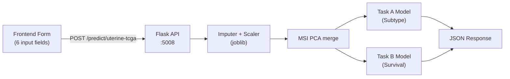

# Uterine Cancer TCGA Model — Frontend Integration Plan

Connect the trained TCGA uterine cancer models (subtype + survival) to the frontend via a Flask microservice. The API returns subtype prediction, survival risk, and per-patient SHAP explanations.

---

## Architecture



Port **5008** to avoid conflicts with existing services (thyroid :5001, anemia :5002, osteoporosis :5003, breast :5004, cervical :5000, uterine-clinical :5007).

---

## Files to Copy Into Backend Folder

From `TCGA-ML/outputs/models/`, copy these **7 files**:

| File | Purpose |
|---|---|
| [task_a_best_model.joblib](file:///c:/Users/Sanjay/Desktop/TCGA-ML/outputs/models/task_a_best_model.joblib) | Random Forest — subtype prediction |
| [task_b_primary_best_model.joblib](file:///c:/Users/Sanjay/Desktop/TCGA-ML/outputs/models/task_b_primary_best_model.joblib) | XGBoost — survival prediction |
| [imputer_task_a.joblib](file:///c:/Users/Sanjay/Desktop/TCGA-ML/outputs/models/imputer_task_a.joblib) | Median imputer for Task A |
| [scaler_task_a.joblib](file:///c:/Users/Sanjay/Desktop/TCGA-ML/outputs/models/scaler_task_a.joblib) | StandardScaler for Task A |
| [imputer_task_b_primary.joblib](file:///c:/Users/Sanjay/Desktop/TCGA-ML/outputs/models/imputer_task_b_primary.joblib) | Median imputer for Task B |
| [scaler_task_b_primary.joblib](file:///c:/Users/Sanjay/Desktop/TCGA-ML/outputs/models/scaler_task_b_primary.joblib) | StandardScaler for Task B |
| [label_encoder_subtype.joblib](file:///c:/Users/Sanjay/Desktop/TCGA-ML/outputs/models/label_encoder_subtype.joblib) | Maps encoded labels → `UCEC_CN_HIGH`, `UCEC_CN_LOW`, `UCEC_MSI`, `UCEC_POLE` |

---

## Frontend Input Fields (6 total)

### Genomic Features (4 fields)

| Field Name | Label | Type | Constraints | Example |
|---|---|---|---|---|
| `mutation_count` | Mutation Count | Number input | min=0, step=1 | `65` |
| `fraction_genome_altered` | Fraction Genome Altered | Number input | min=0, max=1, step=0.0001 | `0.3311` |
| `msi_mantis_score` | MSI MANTIS Score | Number input | min=0, max=2, step=0.0001 | `0.3234` |
| `msisensor_score` | MSIsensor Score | Number input | min=0, max=50, step=0.01 | `0.85` |

### Clinical Features (2 fields)

| Field Name | Label | Type | Constraints | Example |
|---|---|---|---|---|
| `diagnosis_age` | Age at Diagnosis | Number input | min=18, max=100, step=1 | `59` |
| `race_category` | Race/Ethnicity | Dropdown | See options below | `White` |

**Dropdown options for `race_category`:**
- `White`
- `Black or African American`
- `Asian`
- `Native Hawaiian or Other Pacific Islander`
- `American Indian or Alaska Native`

---

## API Endpoint Specifications

### `POST /predict/uterine-tcga`

**Request body** (JSON):
```json
{
  "mutation_count": 65,
  "fraction_genome_altered": 0.3311,
  "diagnosis_age": 59,
  "msi_mantis_score": 0.3234,
  "msisensor_score": 0.85,
  "race_category": "Black or African American"
}
```

**Response** (JSON):
```json
{
  "subtype": {
    "prediction": "UCEC_CN_HIGH",
    "confidence": 0.87,
    "probabilities": {
      "UCEC_CN_HIGH": 0.87,
      "UCEC_CN_LOW": 0.05,
      "UCEC_MSI": 0.06,
      "UCEC_POLE": 0.02
    }
  },
  "survival": {
    "prediction": "LIVING",
    "probability_deceased": 0.23,
    "risk_tier": "Low"
  },
  "shap_explanation": [
    {"feature": "MSI_PC1", "shap_value": -0.42, "direction": "decreases risk"},
    {"feature": "Fraction Genome Altered", "shap_value": 0.38, "direction": "increases risk"},
    {"feature": "Mutation Count", "shap_value": -0.15, "direction": "decreases risk"}
  ],
  "disclaimer": "This is a research prototype using TCGA data. Not clinically validated."
}
```

### `GET /health`
Returns `{"status": "healthy", "model": "uterine_tcga"}`.

### `GET /model-info`
Returns model metadata: features, subtype classes, performance metrics.

---

## Backend Preprocessing Pipeline (inside `app.py`)

The backend must replicate the exact training pipeline:

```
1. Build raw DataFrame (5 numeric columns)
2. One-hot encode race_category → 4 dummy columns (drop_first=True, baseline = American Indian)
3. Impute (median) → imputer.transform()
4. Scale → scaler.transform()
5. PCA merge: MSI MANTIS + MSIsensor → MSI_PC1
6. Predict with model
```

> [!IMPORTANT]
> The one-hot column order **must match** training: `Race Category_Asian`, `Race Category_Black or African American`, `Race Category_Native Hawaiian or Other Pacific Islander`, `Race Category_White`. The baseline (dropped) category is `American Indian or Alaska Native`.

---

## Proposed File Structure

```
backend/uterine-tcga/
├── app.py                      # [NEW] Flask API server
├── requirements.txt            # [NEW] Dependencies
└── model_artifacts/
    ├── task_a_best_model.joblib
    ├── task_b_primary_best_model.joblib
    ├── imputer_task_a.joblib
    ├── scaler_task_a.joblib
    ├── imputer_task_b_primary.joblib
    ├── scaler_task_b_primary.joblib
    └── label_encoder_subtype.joblib
```

---

## Verification Plan

1. Start Flask server on port 5008
2. Send test POST to `/predict/uterine-tcga` with sample data
3. Verify response contains: `subtype`, `survival`, `shap_explanation`, `disclaimer`
4. Test all 5 race dropdown values
5. Test edge cases: very high mutation count, zero values, boundary ages
