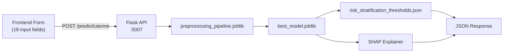

# Uterine Cancer Model — Frontend Integration Plan

Connect the trained uterine cancer risk estimation model to the frontend via a Flask microservice. The API returns a risk tier, probability, per-patient SHAP explanation, and clinical recommendations.

---

## Architecture



Port **5007** chosen to avoid conflicts with your other microservices (thyroid :5001, anemia :5002, osteoporosis :5003, breast :5004, cervical :5000).

---

## Files to Copy Into Your Main Backend Folder

From `uterine cancer clinical detection/outputs/`, copy these **3 files** into your backend's model artifacts directory:

| File | Purpose |
|---|---|
| `best_model.joblib` | Trained Logistic Regression model |
| `preprocessing_pipeline.joblib` | Fitted ColumnTransformer (imputation + scaling + encoding) |
| `risk_stratification_thresholds.json` | Risk tier boundaries (Low/Intermediate/High) |

---

## Frontend Input Fields (18 total)

These are the exact fields the `/predict/uterine` endpoint expects. Group them by section in the UI for good UX.

### Demographics (3 fields)

| Field Name | Label | Type | Constraints | Example |
|---|---|---|---|---|
| `Age` | Age (years) | Number input | min=18, max=100, step=1 | 62 |
| `BMI` | BMI (kg/m²) | Number input | min=10, max=60, step=0.1 | 31.5 |
| `MenopauseStatus` | Menopause Status | Dropdown | `Premenopausal`, `Perimenopausal`, `Postmenopausal` | Postmenopausal |

### Symptoms (4 fields)

| Field Name | Label | Type | Constraints |
|---|---|---|---|
| `AbnormalBleeding` | Abnormal Uterine Bleeding | Toggle (Yes/No) | default: No |
| `PelvicPain` | Chronic Pelvic Pain | Toggle (Yes/No) | default: No |
| `VaginalDischarge` | Abnormal Vaginal Discharge | Toggle (Yes/No) | default: No |
| `UnexplainedWeightLoss` | Unexplained Weight Loss | Toggle (Yes/No) | default: No |

### Clinical Measurements (2 fields)

| Field Name | Label | Type | Constraints | Example |
|---|---|---|---|---|
| `ThickEndometrium` | Endometrial Thickness (mm) | Number input | min=1, max=50, step=0.1 | 18.5 |
| `CA125_Level` | CA-125 Level (U/mL) | Number input | min=0, max=500, step=0.1 | 65.3 |

### Medical History (5 fields)

| Field Name | Label | Type | Constraints |
|---|---|---|---|
| `Hypertension` | History of Hypertension | Toggle (Yes/No) | default: No |
| `Diabetes` | History of Diabetes | Toggle (Yes/No) | default: No |
| `FamilyHistoryCancer` | Family History of Cancer | Toggle (Yes/No) | default: No |
| `Smoking` | Current/Former Smoker | Toggle (Yes/No) | default: No |
| `EstrogenTherapy` | Estrogen Therapy (HRT) | Toggle (Yes/No) | default: No |

### Pathology / Reproductive (4 fields)

| Field Name | Label | Type | Constraints | Example |
|---|---|---|---|---|
| `HistologyType` | Histology Type | Dropdown | `Normal`, `Endometrioid`, `Serous`, `Clear Cell`, `Other` | Normal |
| `Parity` | Parity (live births) | Number input | min=0, max=15, step=1 | 2 |
| `Gravidity` | Gravidity (pregnancies) | Number input | min=0, max=20, step=1 | 3 |
| `HormoneReceptorStatus` | Hormone Receptor Status | Dropdown | `Positive`, `Negative`, `Unknown` | Positive |

---

## API Endpoint Specification

### `POST /predict/uterine`

**Request body** (JSON):
```json
{
  "Age": 62,
  "BMI": 31.5,
  "MenopauseStatus": "Postmenopausal",
  "AbnormalBleeding": "Yes",
  "PelvicPain": "Yes",
  "ThickEndometrium": 18.5,
  "Hypertension": "No",
  "Diabetes": "Yes",
  "FamilyHistoryCancer": "No",
  "Smoking": "No",
  "EstrogenTherapy": "No",
  "CA125_Level": 65.3,
  "HistologyType": "Endometrioid",
  "Parity": 2,
  "Gravidity": 3,
  "HormoneReceptorStatus": "Positive",
  "VaginalDischarge": "No",
  "UnexplainedWeightLoss": "No"
}
```

**Response** (JSON):
```json
{
  "prediction": 1,
  "probability": 0.847,
  "risk_tier": "High",
  "risk_color": "#e74c3c",
  "threshold_used": {
    "low_upper": 0.56,
    "high_lower": 0.65
  },
  "shap_explanation": [
    {"feature": "ThickEndometrium", "shap_value": 1.82, "direction": "increases risk"},
    {"feature": "Age", "shap_value": 1.45, "direction": "increases risk"},
    {"feature": "CA125_Level", "shap_value": 0.91, "direction": "increases risk"},
    {"feature": "AbnormalBleeding", "shap_value": 0.75, "direction": "increases risk"},
    {"feature": "HistologyType_Normal", "shap_value": -0.68, "direction": "decreases risk"}
  ],
  "clinical_recommendations": [
    "Elevated endometrial thickness (18.5 mm) exceeds the 4-5 mm postmenopausal threshold — consider endometrial biopsy.",
    "CA-125 level (65.3 U/mL) is above the reference range (0–35 U/mL) — further evaluation warranted.",
    "Abnormal uterine bleeding in a postmenopausal patient is a clinical red flag — gynaecologic workup recommended.",
    "Patient has comorbid diabetes — monitor for metabolic syndrome as an independent risk factor."
  ],
  "disclaimer": "This is a CDS prototype using synthetic data. Results are not clinically validated. Always defer to clinical judgement."
}
```

### `GET /health`

Returns `{"status": "healthy", "model": "uterine_cancer_lr"}`.

### `GET /model-info`

Returns model metadata: name, version, features, thresholds, limitations.

---

## Proposed File Structure

```
backend/uterine/
├── app.py                   # [NEW] Flask API server
├── requirements.txt         # [NEW] Backend dependencies
└── model_artifacts/
    ├── best_model.joblib            # [COPY from outputs/]
    ├── preprocessing_pipeline.joblib # [COPY from outputs/]
    └── risk_stratification_thresholds.json  # [COPY from outputs/]
```

---

## Clinical Recommendations Logic

The API generates recommendations based on **input values + risk tier**, not ML output. Rules:

| Condition | Recommendation |
|---|---|
| `ThickEndometrium > 4` AND `MenopauseStatus == Postmenopausal` | Endometrial thickness exceeds 4-5 mm postmenopausal threshold — consider endometrial biopsy |
| `ThickEndometrium > 12` AND `MenopauseStatus == Premenopausal` | Endometrial thickness is elevated for premenopausal patient — consider ultrasound follow-up |
| `CA125_Level > 35` | CA-125 above reference range (0–35 U/mL) — further evaluation warranted |
| `AbnormalBleeding == Yes` AND `MenopauseStatus == Postmenopausal` | Postmenopausal bleeding is a clinical red flag — gynaecologic workup recommended |
| `AbnormalBleeding == Yes` AND `Age > 45` | Abnormal bleeding after age 45 — endometrial evaluation recommended |
| `Diabetes == Yes` | Monitor metabolic syndrome as independent risk factor |
| `EstrogenTherapy == Yes` AND `risk_tier in (Intermediate, High)` | Unopposed estrogen therapy in elevated-risk patient — review HRT regimen with provider |
| `BMI > 30` | Obesity (BMI > 30) is an established risk factor — weight management counselling |
| `FamilyHistoryCancer == Yes` AND `risk_tier == High` | Family history + high estimated risk — consider genetic counselling (Lynch syndrome) |
| `risk_tier == High` | General: high estimated risk — strongly recommend gynaecologic oncology referral |
| `risk_tier == Intermediate` | General: intermediate risk — recommend clinical follow-up with gynaecologist |
| `risk_tier == Low` | General: low estimated risk — routine screening per guidelines |

> [!IMPORTANT]
> Every response includes a disclaimer stating this is a CDS prototype with synthetic data and is not a substitute for clinical judgement.

---

## SHAP Per-Prediction Logic

For each prediction, compute individual SHAP values:
1. Run `shap.LinearExplainer` (or `TreeExplainer` if XGBoost is selected) on the preprocessed input
2. Map SHAP values back to original feature names
3. Sort by `abs(shap_value)` descending → return top 5
4. Label each feature as `"increases risk"` (positive) or `"decreases risk"` (negative)

---

## Frontend Display Suggestions

| Section | What to Show |
|---|---|
| **Risk Gauge** | Circular gauge showing probability (0–100%) with colour: green/yellow/red |
| **Risk Tier Badge** | "Low" / "Intermediate" / "High" with colour-coded background |
| **SHAP Feature Chart** | Horizontal bar chart (top 5 features), green bars for protective, red for risk-increasing |
| **Clinical Recommendations** | Bulleted list of actionable clinical recommendations |
| **Disclaimer Banner** | Fixed footer: synthetic data, not clinically validated |

---

## Verification Plan

1. Start the Flask server on port 5007
2. Send a test POST to `/predict/uterine` with sample data
3. Verify response includes all fields: `prediction`, `probability`, `risk_tier`, `shap_explanation`, `clinical_recommendations`, `disclaimer`
4. Verify SHAP values sum correctly and feature names map properly
5. Test edge cases: missing optional fields, extreme values
